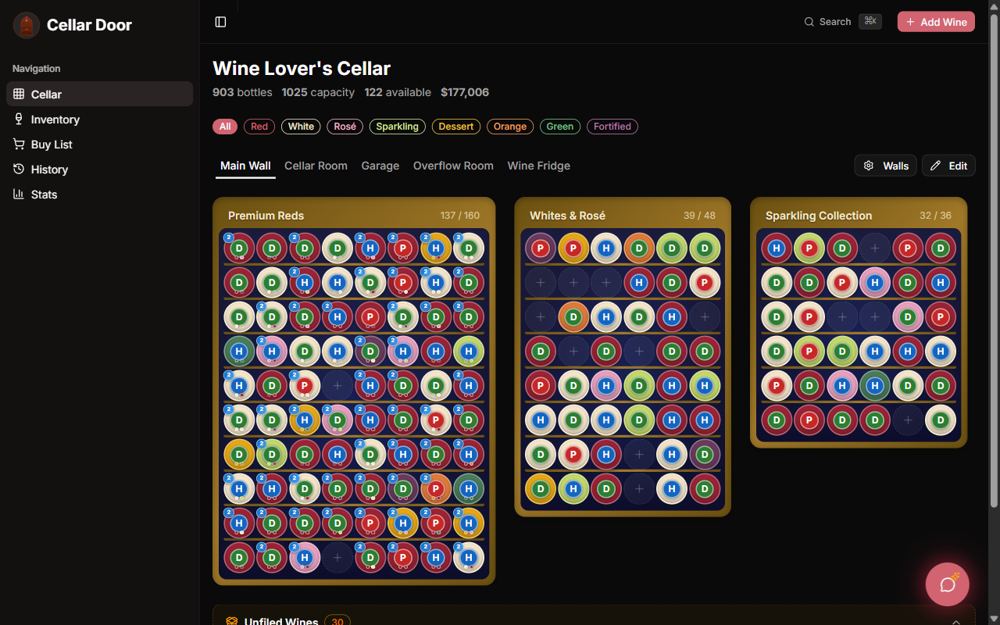

<div align="center">

# Cellar Door

**Your cellar, visualized and beautifully organized.**

A visual-first wine cellar manager: see every bottle exactly where it sits,
let AI do the cataloguing, and know the moment each wine is ready to drink.

[](LICENSE)

[Hosted service](https://mycellardoor.app) · [Live demo](https://mycellardoor.app/demo) · [Self-hosting](SELF-HOSTING.md) · [Contributing](CONTRIBUTING.md) · [Security](SECURITY.md)



</div>

---

Cellar Door started as a personal project for a hand-built home cellar, after
none of the existing apps fit the way a cellar actually works. Most wine apps
are catalogs — a list of what you own. Cellar Door models the **physical
cellar**: walls, racks, cabinets, rows, columns, and depth. When the app says
a bottle is in Row 10, Column 6, you can walk over and pick it up.

On top of that it does the things you'd expect from a modern wine app —
label scanning, ratings, drink windows, stats — plus a few you wouldn't.

## Features

**Physical cellar management**
- Visual rack/slot grid with drag-and-drop placement, multi-bottle depth,
  and bulk-storage zones
- **Sort Assistant** — groups your bottles and walks you through
  rearranging them one move at a time, lighting up the destination slot
- Deep-link to any bottle's location from anywhere in the app

**AI-powered** (bring your own API key when self-hosting)
- Scan a wine label, a barcode, a restaurant wine list, or a purchase
  invoice — the invoice scan reads quantities and prices
- Automatic enrichment: region, grape, drink window, food pairings,
  estimated critic scores
- **Cork & Fork** — tell it what you're cooking and it suggests bottles you
  already own
- Sommelier chat that knows your actual cellar
- Terroir Twins, decant timing, vintage context, pour-cost planning

**Tracking & insight**
- Drink-window guidance (drink now, hold, past peak) and a ready-to-drink
  report
- Personal ratings and community CD Scores
- Taste Profile — what you like and don't, by style, region, and grape
- Stats, value tracking, and a dated insurance-report PDF
- Full history of every bottle consumed, gifted, or sold
- Live cellar temperature and humidity from Home Assistant sensors

**Your data**
- Import from CellarTracker, Vivino, or any spreadsheet (CSV)
- Export everything to CSV or JSON at any time, plus a public REST API

**Platform**
- Mobile-first and installable, with iOS/Android shells via Capacitor

## Plans

The hosted service at [mycellardoor.app](https://mycellardoor.app) is free
for unlimited bottles. The paid plans, Cellar+ and Cellar Pro, add the AI
features and pay for the AI calls behind them. Self-hosting is free, with
every feature unlocked.

## Tech stack

Next.js 16 (App Router) · React 19 · TypeScript · Tailwind v4 + shadcn/ui ·
Prisma + Postgres · Firebase Auth · Stripe · pluggable AI providers
(Gemini / DeepSeek / Qwen / any OpenAI-compatible endpoint)

## Try it in 30 seconds

Requires Node.js 22.

```bash
git clone https://github.com/golive-ready-llc/cellar-door.git
cd cellar-door
npm install
echo 'NEXT_PUBLIC_USE_MOCK=true' > .env.local
npm run dev
```

Open http://localhost:3000 — no database, no accounts, no API keys.

Or run the real thing with Docker (app + Postgres, no other services):

```bash
cp .env.docker.example .env    # then set DATABASE_URL creds and a password
docker compose up -d
```

For a real install — including a **single-user mode** with no sign-in at
all — see **[SELF-HOSTING.md](SELF-HOSTING.md)**.

## Self-hosting vs. the hosted service

**Self-hosting is free** — the whole app, every feature, no license fee. Run
`docker compose up -d` (it brings its own Postgres) and you're done. Two things
don't travel with it, and it's worth being upfront about them:

- **AI costs money per call.** Self-hosted, you bring your own provider key
  and pay that provider directly. Nothing is feature-crippled — set
  `NEXT_PUBLIC_DEFAULT_TIER=PREMIUM` and every feature unlocks without
  Stripe.
- **Community ratings are other people's data.** The CD Score dataset is
  aggregated from hosted-service users and isn't distributed here, so a new
  instance starts with an empty community.

Subscriptions to [mycellardoor.app](https://mycellardoor.app) pay for
exactly those two things plus hosting — not for access to the source.

## Security

Please report vulnerabilities privately to **security@mycellardoor.app**, not
in a public issue. See [SECURITY.md](SECURITY.md) for details.

## License

[AGPL-3.0](LICENSE) — the GNU Affero General Public License v3, OSI-approved
open source. You can use, run, modify, self-host, and redistribute the code
freely. Its network copyleft is the one catch: if you run a **modified** version
as a service to others, you must offer those users the source of your modified
version under the same license — so improvements stay open.

The **name and logo are not covered** by the license — they're trademarks of
Golive Ready, LLC. If you run your own instance publicly, brand it as your own.
See [NOTICE](NOTICE).

Contributions require a CLA so the project can continue to be offered both
under the AGPL and commercially — see [CONTRIBUTING.md](CONTRIBUTING.md).

## Support expectations

This is a small project maintained alongside a commercial service. Bug
reports with reproductions are welcome; self-hosting setup help is
best-effort. Please read [CONTRIBUTING.md](CONTRIBUTING.md) first.

---

<div align="center">
<sub>Copyright © 2026 Golive Ready, LLC</sub>
</div>
